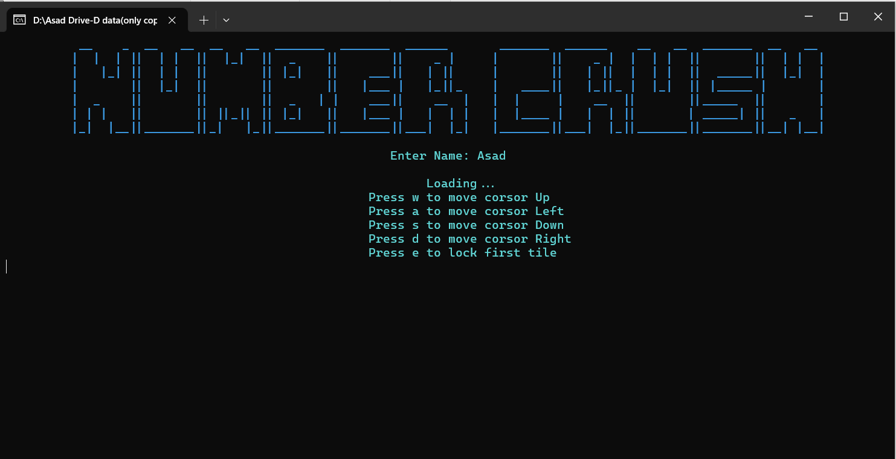
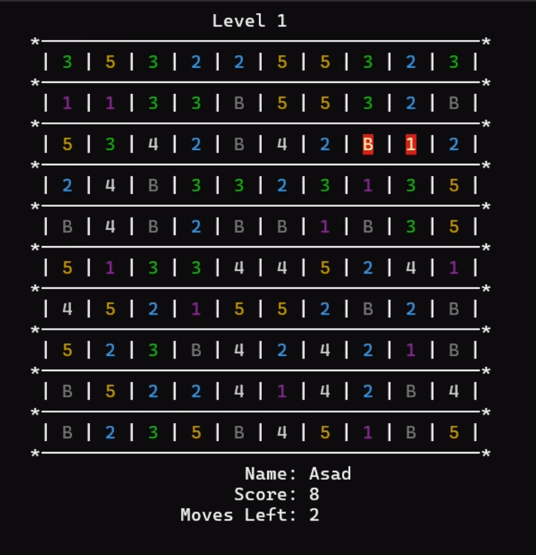
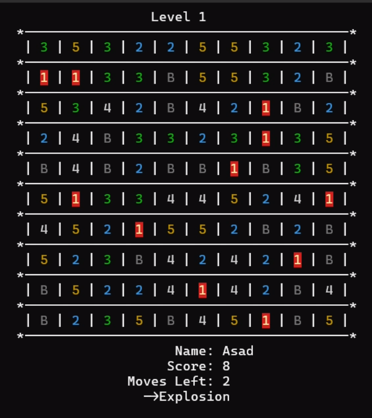

# Number Crush

This repository contains the source code for "Number Crush," a simple game developed in Irvine library for x86 assembly language.

## Description
"Number Crush" is a game where players aim to clear numbered blocks from the game board by selecting adjacent blocks that add up to a target number. The game features three levels of increasing difficulty, bomb functionality to clear multiple blocks at once, and cursor movement using the W, S, A, and D keys.

## Features
- Three levels of gameplay.
- Bomb functionality to clear multiple blocks.
- Cursor movement using W, S, A, D keys.

## How to Play
1. Use the W, S, A, and D keys to move the cursor.
2. Press E to select a block.
3. Select adjacent blocks that add up to the target number to clear them.
4. Clear all blocks to advance to the next level.

## Usage
1. Clone the repository: `git clone https://github.com/your-username/number-crush.git`
2. Assemble the source code using an x86 assembly language assembler.
3. Run the compiled executable.

## Credits
Developed by ME 

## License
This project is licensed under the [MIT License](LICENSE).

## Glimpse

    
    
    

